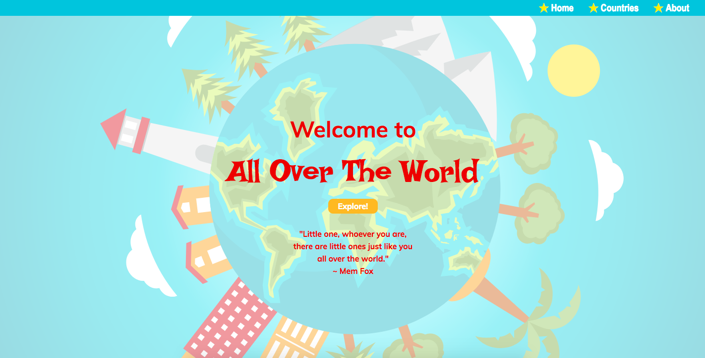
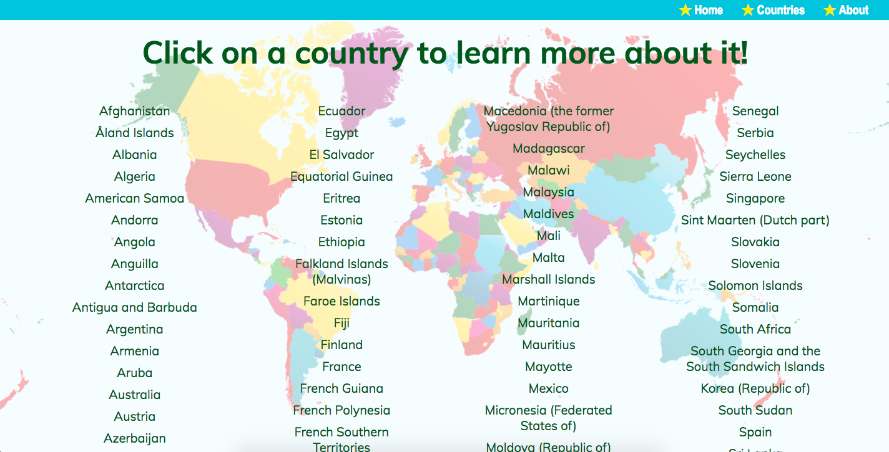
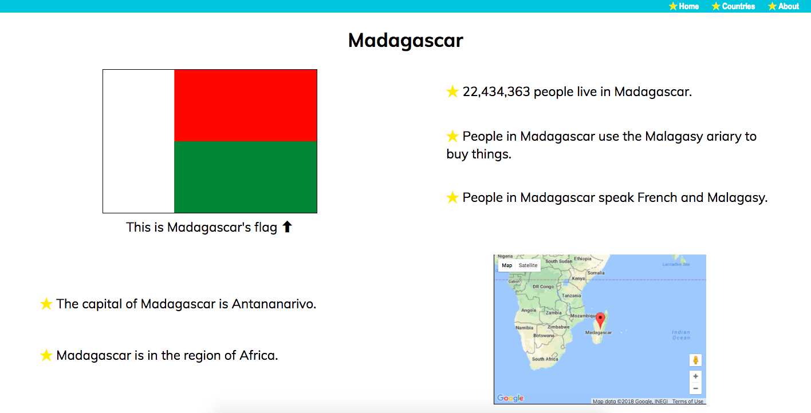

# All Over The World - React/Redux with API Integration

## Objectives

1) Build an educational website with a child-friendly interface that helps users become familiar with countries around the world.

2) Meet the following assignment requirements:
  * Online API integration
  * Single Page Application with 3 page views using React Router
  * Responsive

### Homepage


### Countries
When component mounts, a request is sent to `https://restcountries.eu/rest/v2/all` for a full list of countries, and the page displays all country names in Link components.



### Individual Country Page
When component mounts, a request is sent to `https://restcountries.eu/rest/v2/alpha/:alpha2code` using the 2-letter country code. Country-specific response data is manipulated in JavaScript and displayed on the page. In a sub-component, the latitude and longitude of the country (found in the response data of the request) are used to make a request to the Google Maps API and render a map of the country.



## Technologies Used
* React
* JavaScript
* HTML
* CSS
* React Router
* AJAX
* Redux
* Axios + Thunk

## Code Snippets

Although Redux is generally unnecessary for applications of this size, I chose to use Redux and Thunk here to solidify my understanding of the concepts in preparation for building larger applications in the future. API requests are made in Redux action creators, applying Thunk as middleware:

```
export function getCountries() {
    return function(dispatch) {
        axios.get(countriesUrl)
            .then(response => {
                dispatch({
                    type: 'GET_COUNTRIES',
                    countries: response.data
                })
            })
            .catch(err => {
                console.error(err);
            })
    }
}
```

Functions making API requests in Redux are made available as props through the React-Redux `connect()` method. They are called from individual components in the life cycle method `componentDidMount()`:

```
componentDidMount() {
        this.props.getCountries();
    }
```

## Challenges and Insights

One challenge I faced during this project was displaying language and currencies in the `Country` component. Data about languages and currencies for each country comes in an array of objects. The sentence structure needed to change based on the length of the array. I used JavaScript to manipulate the data and return nicely formed sentences:

```
toCurrencyString(currencies, countryName) {
    let currStr = `People in ${countryName} use the `;
    if (currencies.length === 1) {
        currStr += `${currencies[0].name} to buy things.`;
    } else if(currencies.length === 2) {
        currStr += `${currencies[0].name} and the ${currencies[1].name} to buy things.`;
    } else if(currencies.length > 2) {
        for(let i = 0; i < currencies.length; i++) {
            if (i === currencies.length - 1) {
                currStr += ` and the ${currencies[i].name} to buy things.`;
            } else if (i < currencies.length - 1) {
                currStr += `${currencies[i].name}, `;
            }
        }
    } 
    return currStr;
}
```

One of the most challenging aspects of this project was conceptualizing the flow of the asynchronous requests in Redux and rendering the data from those requests in the React components. I needed to load the component, make the request when the component mounted, but delay displaying the page until the data had been received in Redux and passed into the component. In the `Country` component, I ran into an issue with the previously-clicked country's data displaying for a split second while the new country's data was requested. Once the data was received, the page would update, but it was really unpleasant to see the previous country flash on the screen every time the user navigated to a country page. I used `componentWillReceiveProps()` and the local `state` to indicate whether the component should render the data or display "loading" while it waited to receive new data. 

While trying to solve this issue, I first reviewed past assignments and lessons to see if there was a similar solution in there. I then used Google, asked a classmate, and finally an instructor for help. It was frustrating to spend so much time looking for a solution when my instructor was immediately able to answer my question once I asked. However frustrating, this experience taught me that while time spent searching for a solution can feel like wasted time, the process itself is valuable to my learning. Having a solution handed to me at the first sign of struggle would have allowed me to move forward more quickly with my application, but spending time in the struggle required me to use my problem solving skills, try possible solutions and identify why they didn't work, and push myself a little harder.

### Other Information

This project was bootstrapped with [Create React App](https://github.com/facebookincubator/create-react-app).
